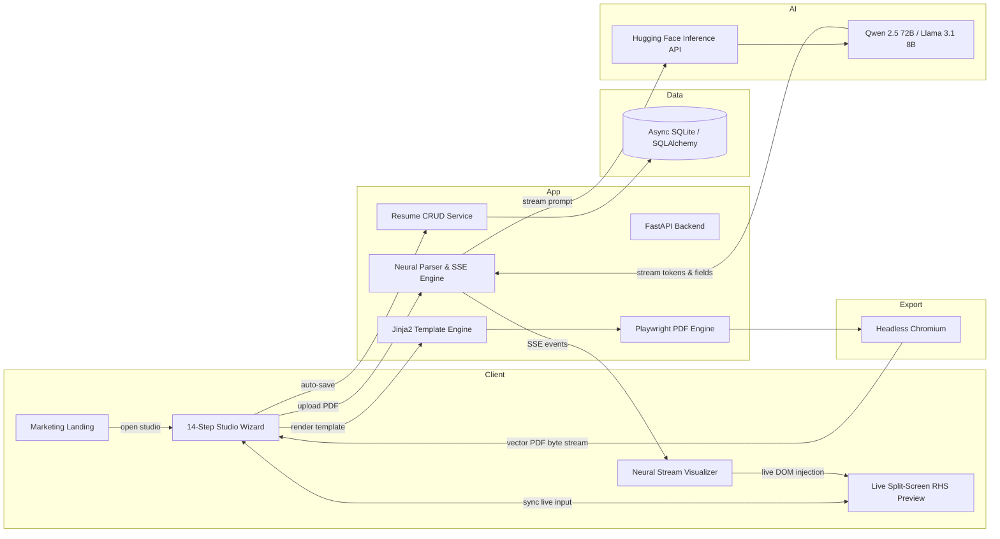
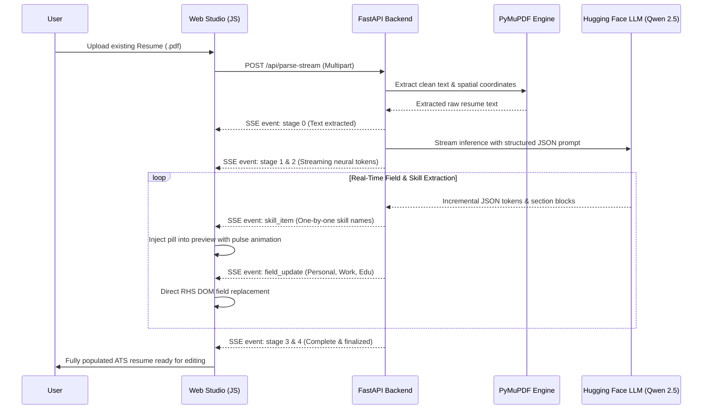

<div align="center">

<!-- ═══════════════════════════════════════════════════════════
     HERO BANNER — ResuMate × Electric Indigo AI Studio
     ═══════════════════════════════════════════════════════════ -->


<br/>


<br/>

### Architect your career — upload an existing PDF, stream-extract live into ATS templates, and optimize with AI

FastAPI · Python 3.12 · Hugging Face · Playwright · Jinja2 · Tailwind / CSS3  
— one unified studio that turns static documents into dynamic, interview-winning resumes.

<br/>


<br/>

[](#-license)
[](#-features)
[](#-how-it-works)
[](#-tech-stack)

<br/>

</div>

---

## At a Glance

<table>
<tr>
<td width="33%" align="center">

### Neural Streaming

PyMuPDF layout extraction · live token SSE  
instant field-by-field & skill-by-skill DOM injection

</td>
<td width="33%" align="center">

### STAR AI Optimizer

XYZ impact formula · quantified KPIs  
executive, technical & metrics modes

</td>
<td width="33%" align="center">

### Studio & Budgeting

8 ATS templates · live split preview  
exact Playwright page count locking

</td>
</tr>
</table>

**Core flow**

```text
Upload Resume PDF  →  PyMuPDF Text Extract  →  SSE Stream to Qwen/Llama LLM  →  Stream Skills & Fields Live
                                                                                           ↓
                                                            Real-Time RHS DOM Injection & Highlight Pulse
                                                                                           ↓
                     Select ATS Theme (8 Styles)  →  AI STAR Bullet Optimizer  →  Download Pixel-Perfect PDF
```

<div align="center">

### System Architecture



### Real-Time Streaming Parse Sequence



</div>

---

## Overview

ResuMate is an **AI-powered resume engineering studio** designed to transform static resumes and raw career histories into interview-generating, ATS-compliant documents.

Instead of treating resume creation as tedious manual data entry, the platform:

- Ingests existing resumes in PDF format with **PyMuPDF** text layout extraction
- Streams extraction results token-by-token in real time via **Server-Sent Events (SSE)** powered by **Hugging Face open-weight LLMs (Qwen 2.5-72B-Instruct / Llama 3.1-8B-Instruct)**
- Renders live updates directly into the **RHS Resume Preview** with pulse animations as skills and fields stream in
- Features an **AI STAR Bullet Point Optimizer** converting vague duties into high-impact XYZ statements with quantifiable metrics
- Houses an **8-Theme ATS-Optimized Template Engine** (Harvard ATS, Modern, Executive, Minimalist, Tech, Creative, Contemporary, Standard ATS)
- Uses **Playwright Headless Chromium** for vector-accurate, print-perfect PDF generation with strict single-page/two-page layout budgeting
- Auto-saves asynchronously to **SQLite** via SQLAlchemy 2.0 with zero data loss

---

## Features

<table>
<tr>
<td valign="top" width="50%">

#### Neural Ingestion & Parsing

- PDF upload with spatial text layout analysis
- Real-time Server-Sent Events (SSE) progress pipeline
- Live token stream visualizer modal
- Instant live RHS preview DOM injection
- One-by-one streaming skill chip placement with pulse effect
- Structured JSON-Resume schema validation & recovery

#### Studio & Workspace

- 14-step guided resume wizard
- Dual-panel split-screen layout with instant debounced refresh
- Section drag-and-drop reordering with persistent index
- Dynamic custom section creation
- LocalStorage state caching + async SQLite auto-save
- Auto-collapsing empty sections for clean presentation

</td>
<td valign="top" width="50%">

#### AI Optimization & STAR Engine

- Google XYZ formula: *Accomplished [X] by doing [Z], as measured by [Y]*
- 4 targeted optimization modes: STAR, Executive, Technical, Quantified
- Metric synthesis: automated KPI & percentage suggestions
- Strong action verb enrichment and weak phrasing elimination
- Context-aware role & company prompt conditioning

#### Templates & Production Export

- 8 industry-vetted ATS templates (Harvard ATS, Modern, Tech, etc.)
- Playwright Headless Chromium pixel-perfect PDF rendering
- Strict page budgeting engine (`/api/page-count`) to prevent orphan lines
- WeasyPrint lightweight fallback generator
- Light and dark studio interface themes
- Mobile, tablet, and widescreen responsive layouts

</td>
</tr>
</table>

---

## How It Works

### Step 1 — Import or Start Fresh

Launch the studio at `/builder`. Upload an existing resume PDF or start with a clean slate across the 14 organized sections.

### Step 2 — Real-Time Streaming Parse

When uploading a PDF, watch the real-time SSE stream extract contact information, work history, education, and skills. Skills and bullet points populate live into the right-hand preview panel one by one with glowing micro-animations.

### Step 3 — AI Bullet Optimization

Click the AI wand next to any work experience or project bullet point. Select your preferred mode (STAR, Executive, Technical, or Quantified) and let the LLM transform generic responsibilities into high-impact, measurable achievements.

### Step 4 — Switch Templates & Lock Page Budget

Choose from 8 ATS-ready template designs in the template drawer. Use the page budgeting gauge to inspect total pages and lock your document into an exact 1-page or 2-page format without spillover.

### Step 5 — Export Pixel-Perfect PDF

Click **Download PDF** to trigger Playwright's headless Chromium print engine, generating an exact, vector-rendered ATS-friendly PDF ready for applications.

---

## Tech Stack

| Layer | Tools |
|-------|--------|
| Backend App | FastAPI, Python 3.12+, Uvicorn, Pydantic v2 |
| AI & LLMs | Hugging Face Inference API (`Qwen/Qwen2.5-72B-Instruct`, `Llama-3.1-8B-Instruct`) |
| Parsing & Ingestion | PyMuPDF (fitz), Server-Sent Events (SSE), JSON-Resume standard |
| Frontend & UI | Vanilla JavaScript (ES6+), Modern CSS3 Design System, Inter Typography |
| Template Engine | Jinja2 with custom filters and 8 modular ATS themes |
| PDF Engine | Playwright (Headless Chromium) with WeasyPrint fallback |
| Database & ORM | SQLAlchemy 2.0 (Async), aiosqlite, Alembic migrations |

---

## Project Structure

```text
ResuMate/
├── app/
│   ├── api/                      # API routing & dependency injection
│   │   ├── deps.py               # Service dependencies
│   │   ├── pages.py              # HTML page routing (/, /builder)
│   │   └── routes.py             # REST API endpoints (CRUD, parse-stream, optimize-bullet, PDF)
│   ├── core/                     # Application configuration & security
│   │   ├── config.py             # Pydantic BaseSettings & env configs
│   │   ├── database.py           # Async SQLAlchemy engine & session factory
│   │   └── security.py           # Input sanitization (bleach) & XSS prevention
│   ├── models/                   # SQLAlchemy ORM models
│   │   ├── base.py               # Declarative base & timestamp mixin
│   │   ├── resume.py             # Resume, Experience, Education, Skills tables
│   │   └── user.py               # User identity & authentication model
│   ├── schemas/                  # Pydantic validation schemas
│   │   ├── resume.py             # ResumeCreate, ResumeUpdate, ResumeData
│   │   └── user.py               # User auth schemas
│   ├── repositories/             # Database access layer
│   │   └── resume_repository.py  # Async CRUD operations
│   ├── services/                 # Core business & AI orchestration logic
│   │   ├── parser.py             # PyMuPDF extraction, HF streaming & STAR optimizer
│   │   ├── pdf_service.py        # Playwright & WeasyPrint PDF engines
│   │   ├── resume_service.py     # Resume data lifecycle & state management
│   │   └── template_service.py   # Jinja2 template discovery & rendering
│   ├── templates/                # Jinja2 templates & themes
│   │   └── resume_templates/     # 8 modular ATS-ready themes
│   │       ├── ats/ · modern/ · harvard_ats/ · tech/
│   │       ├── executive/ · minimalist/ · contemporary/ · creative/
│   │       └── base.html         # Base template layout
│   ├── frontend/                 # Client application & UI assets
│   │   ├── index.html            # Marketing landing page
│   │   ├── builder.html          # Dual-panel interactive resume studio
│   │   └── static/
│   │       ├── css/              # Design system tokens, wizard, preview, landing
│   │       └── js/               # Modular ES6 controllers (preview, wizard, store, app)
│   └── main.py                   # FastAPI application factory & lifespan
├── alembic/                      # Database migration scripts
├── tests/                        # Pytest unit & integration test suite
├── data/                         # SQLite database storage (auto-created)
├── exports/                      # Cached PDF exports
├── uploads/                      # Temporary upload staging
├── requirements.txt              # Production & development dependencies
├── Dockerfile                    # Containerization specification
├── docker-compose.yml            # Multi-service composition
└── .env.example                  # Environment configuration template
```

---

## First-Time Setup

### 1. Clone repository

```bash
git clone <your-repo-url>
cd ResuMate
```

### 2. Install dependencies

```bash
# Create and activate Python virtual environment
python -m venv venv
venv\Scripts\activate       # On Linux/macOS: source venv/bin/activate

# Install Python requirements
pip install -r requirements.txt

# Install Playwright Headless Chromium browser
python -m playwright install chromium
```

### 3. Environment

Create a `.env` file in the project root:

```env
DEBUG=true
DATABASE_URL=sqlite+aiosqlite:///./data/resume_builder.db
SECRET_KEY=generate_a_secure_random_key_here
ALLOWED_ORIGINS=http://localhost:8000,http://127.0.0.1:8000

# PDF Engine — "playwright" (recommended) or "weasyprint"
PDF_ENGINE=playwright

# Hugging Face API Token for AI Parsing & STAR Bullet Optimizer
HF_TOKEN=your_huggingface_token_here
```

### 4. Database

```bash
# Run database schema migrations
alembic upgrade head
```

---

## Run The Application

```bash
uvicorn app.main:app --reload --port 8000
```

Then open [http://localhost:8000](http://localhost:8000).

| Route | Method | Description |
|-------|--------|-------------|
| `/` | `GET` | Marketing landing page with hero, features & template gallery |
| `/builder` | `GET` | Interactive split-screen resume builder studio |
| `/api/parse-stream` | `POST` | Real-time SSE streaming PDF parser & live DOM injector |
| `/api/ai/optimize-bullet` | `POST` | AI STAR method bullet point optimizer with quantifiable metrics |
| `/api/preview` | `POST` | Live HTML preview renderer for instant debounced updates |
| `/api/page-count` | `POST` | PDF page budgeting engine for strict 1/2 page layout locking |
| `/api/download/pdf` | `POST` | Vector-accurate PDF generator via Playwright Chromium |
| `/api/templates` | `GET` | List all 8 available ATS-optimized resume themes |
| `/api/resumes` | `POST` / `GET` | Create, read, and persist resumes to database |
| `/api/health` | `GET` | Health check endpoint for container and uptime monitoring |

---

## Notes

- The repository and application name are **ResuMate**.
- Parsing runs on **PyMuPDF** combined with **Hugging Face open-weights inference**, delivering fast Server-Sent Events (SSE) with stage tracking and token streaming.
- Skills and resume sections stream directly into the right-hand preview DOM in real-time with visual highlight cues before full JSON schema resolution finishes.
- The **STAR Bullet Optimizer** supports 4 distinct engineering and leadership modes (`star`, `executive`, `technical`, `quantified`) to convert weak bullet points into measurable achievements.
- Resumes are rendered using **Playwright Headless Chromium** for zero layout drift between screen preview and downloaded PDF.

---

## Author

### Mohammad Bilal

Software Engineering Student  
AI + Full Stack Developer

---

## License

This project is licensed under the MIT License.

---

## Support

If you liked this project:

- Star the repository
- Fork the project
- Contribute improvements

---

<div align="center">


<br/>

**[Back to top](#at-a-glance)**

<br/>

<sub>ResuMate · FastAPI · Python 3.12 · Hugging Face · Playwright · Jinja2 · Tailwind CSS · SQLite</sub>

</div>
